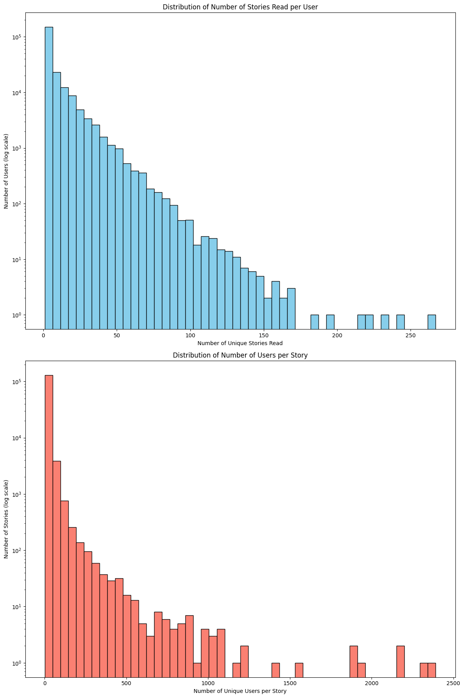
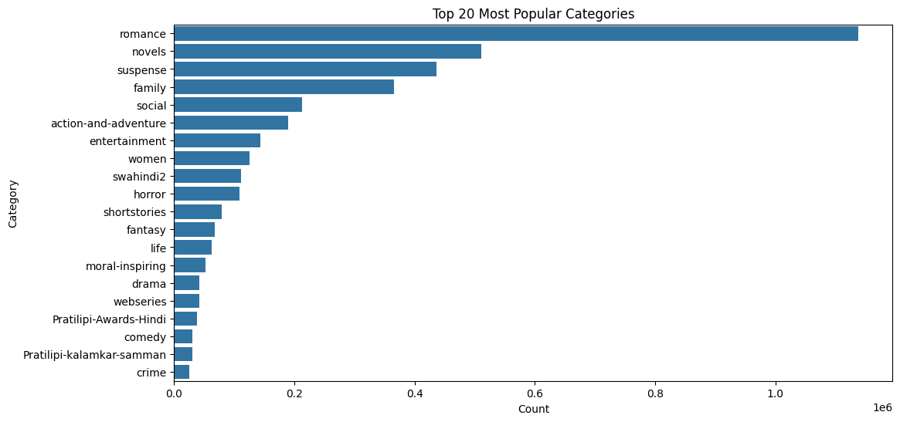
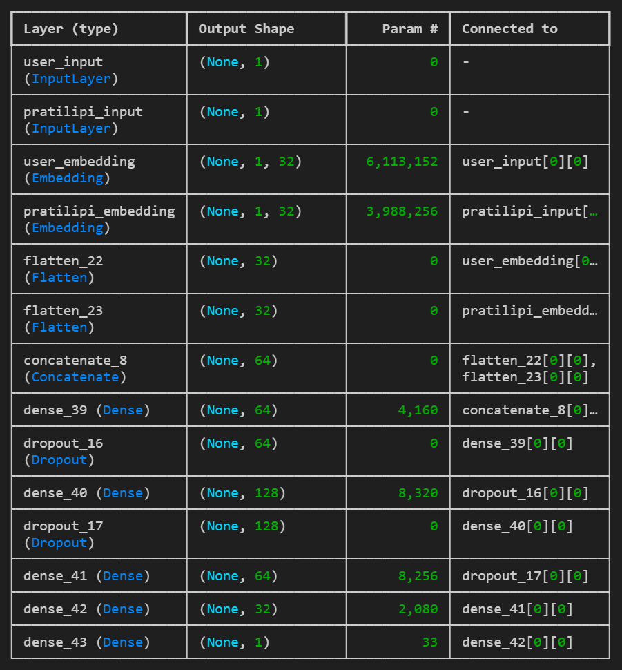
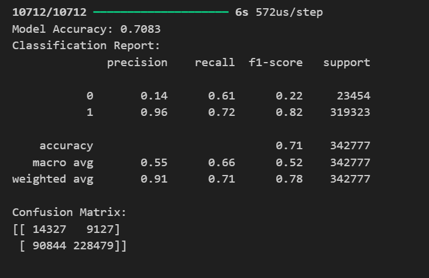

# **Recommendation system for Pratilipi**

This repository showcases a step-by-step Neural Collaborative Filtering pipeline for recommending Pratilipis . The approach involves preparing data, building a Keras model with embedding layers, training & evaluating the model, and finally generating item- and user-based recommendations.


## **App Demonstration**

<video width="600" controls>
  <source src="Video_demonstration/recommendation_system.gif" type="video/mp4">
  Your browser does not support HTML5 video.  
</video>


## **Objectives**

1. **Predict Future Reading Behavior**
    - Building a model to predict at least 5 Pratilipis that each user will read based on the user's behavior.
2. **Train/Test Split**
    - the train set should contain 75% of the data and the rest must have 25%.
3. **Model goal**
    - To Train multiple classification models and choose the one with good recall score, less overfitting and good accuracy.

    
## **Repository Structure**

- `notebook`
    - Contains the main Jupyter notebook (`project_notebook.ipynb`) where data analysis, model building, and evaluation are performed.
- `data/`
    - Directory for our datasets used.
- `streamlit_app.py`
    - Streamlit application to demonstrated how recommendations can be served interactively.
- `requirements.txt`
    - Lists the libraries and versions needed to replicate the environment.

## **Getting Started**

1. ### **Clone the Repository**

```bash
  git clone https://github.com/hrishi-DevAI/Pratilipi-Recommendation-System.git

```
2. ### **Install Dependencies**
Make sure you have `Python 3.10+` for the required packages
```bash
pip install -r requirements.txt
```
3. ### **Run the Jupyter Notebook**
If using VSCODE make sure ipykernel is installed
```bash
project_notebook.ipynb
```
## **Data Analysis**
### **User engagement**
The following plots will demonstrate the `Number of Unique story read by per user` and ` Number of Unique user per story`

1. **Distribution of Number of Stories Read per User**:
    - Highly Skewed Distribution: Most users read very few unique stories, while only a small fraction of users read a large number of stories.
    - Power-Law Behavior: A few users are highly engaged, consuming hundreds of stories, but the majority consume just a handful.
2. **Distribution of Number of Users per story**:
    - Long-Tail Distibution: A small number of stories are extremely popular, being read by thousands of users.

### **Category Analysis**
the following plot will provide the Top 20 most popular categories.

1. `Romance Dominates` - The "romance" category is by far the most popular, with significantly higher read counts than other categories.
2. `Novels & Suspense` - These two genres also have a high engagement, meaning users prefer long-format storytelling with thrilling elements.
3. `Family & Social Stories` Are Also Popular - Categories like family and social indicate that users also engage with stories that reflect relationships and societal themes.
4. **Niche Genres** (Lower Counts) - Categories like `horror`, `swahindi2`, `women`, `entertainment` `shortstories`,`fantasy`,`life`,`moral-inspiring` have relatively lower engagement.

### **Reading time**
The following plot will demonstrate peak times when users typically areengaged with pratilipis.

1. The highest user activity occurs between 4 PM to 6 PM, with the peak at 5 PM (17:00).This could indicate that users prefer to engage with Pratilipi content in the late afternoon and early evening.
2. There is a steep decline in activity from 10 PM (22:00) onwards, reaching the lowest points between midnight (00:00) and 6 AM.
3. There is a slight dip in activity around lunchtime (12 PM - 2 PM) before picking up again in the afternoon.

### **Most engaging content based on Published Date**
The following plot will demonstrate which year's published content are more engaging for the readers.

1. The highest average read percentage is observed in 2021 and 2022, where it reaches around 95%. This indicates that newer content is more engaging to readers.
2. In 2015, there was a dip in the average read percentage, dropping to the lowest point (77%)
3. The sharpest increase happened between 2018 and 2019, where the average read percentage jumped from 83% to 90%.
4. From 2019 onwards, the read percentage consistently increased year over year, showing that more recent content has been well-received.

#### **The `Project_notebook.ipynb` file contains more indepth insights and a very detailed analysis of the data**

## **Model Overview**
1. **Neural Collaborative Filtering Architecture**

2. **Loss & Metrics**
    - `binar-crossentropy` loss for read vs not read prediction
    - `Accuracy`,`Precision`,`Recall` and `F1 scores` for evaluation
4. **Recommendation strategy**
    - For each user, the model scores every pratilipi
    -  we sort pratilipis by predicted probability and take the top 5 as recommendations.

## **Results**


## **Example Usage**
1. **User-Based**
```python

test_user_id = "5506791978752866"  # Some raw user ID from your dataset

# Call the recommendation function
recommendations = recommend_pratilipis_for_user(
    user_id=test_user_id,
    model=model,
    user_encoder=user_encoder,
    pratilipi_encoder=pratilipi_encoder,
    train_df=train_df,  # or whichever DataFrame contains the pratilipi_ids
    top_n=5
)

print(f"Recommended pratilipis for user {test_user_id}: {recommendations}")
```
2. **Item-Based**
```python

#  Pick a pratilipi
some_pratilipi_id = '1377786227025240'  # raw ID 

#  Get 6 similar pratilipis
recommendations = recommend_similar_pratilipis_by_item(
    pratilipi_id=some_pratilipi_id,
    pratilipi_encoder=pratilipi_encoder, 
    item_embeddings=item_embeddings,
    top_n=5
)

print("Since you liked pratilipi:", some_pratilipi_id)
print("You might also like:", recommendations)
```

## **Run the app Locally**

Clone the project

```bash
  git clone https://github.com/hrishi-DevAI/Pratilipi-Recommendation-System.git
```

Go to the project directory

```bash
  cd Pratilipi-Recommendation-System
```

Install dependencies

```bash
  pip install -r requirements.txt
```

Start the server

```bash
  streamlit run streamlit_app.py
```
## **Contributing**
Pull requests are welcome. For major changes, please open an issue first to discuss what you’d like to change or add.

## **Contact**
if you have questions or want to share improvements, feelfree to reach out:
- **Name**: Hrishikesh Das
- **Email**: your.email@example.com  
- **LinkedIn**: [LinkedInProfile](https://www.linkedin.com/in/hrishikesh-das-200114dec/)